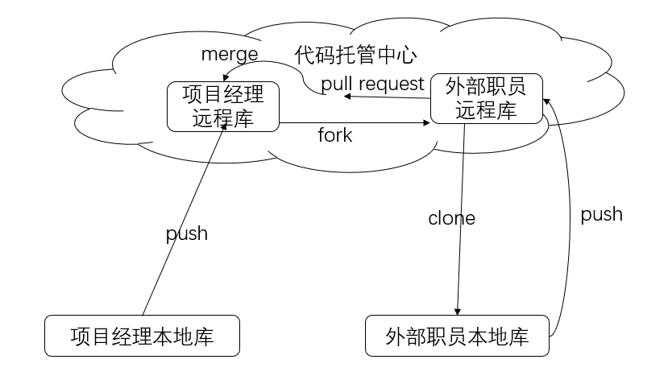

# 一、git概述

## 1.1git是什么

git是分布式版本控制系统。
git可以管理你的版本信息。我们常用的版本控制大多是使用副本，但这样过于麻烦且不好维护。git可以在本地电脑中生成一个版本库，版本库相当于在你的文件目录下创建了一个.git目录，这个目录里面的所有文件都可以被git管理起来，每个文件的修改，删除，git都能跟踪,控制你的版本，在任何时间都能查看历史版本及还原其中某一版本。优点在于易于维护和协同开发。比如你的master分支他人正在使用，而你又想更新或者维护，那你可以开辟另一条分支而不影响主分支。这就是分布式版本控制。

## 1.2下载git

进入git官网(<https://git-scm.com/>)直接下载。

下载成功后，进入任意文件夹，右键鼠标，当选项中出现 git bush here表示则安装成功了。

## 1.3本地库与远程库交互方式

### 1.3.1团队内部协作



- 项目经理王经理创建了一个本地库和一个远程库，项目经理将本地库推送至远程库（push）
- 职员小吴将远程库中的内容克隆至自己的本地库（clone）
- 职员小吴将克隆下来的内容做了修改之后，加入王经理的团队，将本地库的内容推送至王经理的远程库（push）
- 王经理将远程库中修改好的内容拉取至自己的本地库

### 1.3.2团队外部协作


- 项目经理王经理创建了一个本地库和一个远程库，项目经理将本地库推送至远程库（push）
- 外部职员小王将王经理远程库中的内容fork至自己的远程库（fork）
- 外部职员小王将将自己的远程库的内容克隆至本地库（clone）
- 外部职员小王做好修改后推送至自己的远程库（push）
- 外部职员小王向项目经理王经理发送一个拉取请求（pull request）
- 项目经理王经理对内容审核，没问题后进行合并操作

# 二、git的基本命令行操作

### 2.1 初始化本地仓库

```shell
git init 文件名
```
使用该命令后，你会发现在该文件夹下多了个.git文件并且自动创建了master分支（如果没看见可以在文件夹的查看中将隐藏文件改成可见），这个.git文件就是用来追踪你的版本信息的。切记不要随便更改.git文件里的内容，不然会破坏你的git仓库。

### 2.2 设置签名

```shell
# 项目级别(仓库级别）：仅在当前本地库范围内有效
# 信息保存位置： .git 目录下的 config 文件中
$ git config user.name Jason
$ git config user.email Jason@gmail.com
# 系统用户级别：登录当前操作系统的用户范围
# 信息保存位置：~/.gitconfig （根目录下的 .gitconfig文件中）
$ git config --global user.name Jason
$ git config --global Jason@gmail.com
```

级别优先级：

- 就近原则：项目级别优先于系统用户级别，二者都有时采用项目级别的签名
- 如果只有系统用户级别的签名，就以系统用户级别的签名为准
- 不允许二者都没有

### 2.3查看文件状态
我们可以使用 git status 命令来查看相关文件的状态。
```shell
$ git status
```
- 当项目位置没有文件时，会显示On branch master，No commits yet，nothing to commit，意思就是你处在master分支上，还没有提交记录，没有东西可以提交

- 当项目位置有文件时
  - 当你有未提交文件时，会显示On branch master，No commits yet，意思就是你处在master分支上，还没有提交记录，同时将你未提交的文件报红处理，表示这个文件还没提交。
  - 当没有未提交文件时，会将已添加至缓存区的文件显示为绿色，并推荐你将缓存区的文件提交至本地库
  - 当已提交文件被修改，会将修改过的文件报红

### 2.4 添加文件到缓存区
git add 命令可将文件添加到缓存
```shell
$ git add 文件名
```
新项目中，添加所有文件很普遍，可以使用如下命令：
```shell
$ git add .
```
也可以同时添加同一类文件，如:
```shell
$ git add *.java 
$ git add *.c
```
到这一步文件只是提交添加到了缓存区，还并没有到仓库。
### 2.5 取消缓存的文件
git reset HEAD 命令用于取消已缓存的内容。
```shell
$ git rm --cached 文件名
# 或
$ git reset HEAD 文件名
```
### 2.6 提交文件到本地仓库
git commit 将缓存区内容添加到仓库中，可以在后面加-m选项，表示给版本信息添加注释，如：
```shell
$ git commit -m "第一次版本提交" 文件名
$ git commit -m "新增了xxx功能" 文件名
```
很多时候我们觉得先添加到缓存区在提交到仓库很麻烦时，可以在后面加 -a，这样就直接提交到仓库了，如：
```shell
$ git commit -am "第一次版本提交" 文件名
$ git commit -am "新增了xxx功能" 文件名
```
提交仓库后，即使你删除或修改了文件，也可以在.git文件中找到以前的版本。
### 2.7 查看提交记录
通过 git log 命令进行查看提交历史记录
```shell
# 会显示版本号、作者、时间、版本注释。
$ git log
# 会显示版本号、版本注释。
$ git log --pretty=oneline
# 会显示部分版本号、版本注释。
$ git log --oneline
# 会显示部分版本号、HEAD值、版本注释。
$ git reflog
```
### 2.8 版本回退
 方法一：使用 git reset –hard HEAD^ 命令来回退版本。^ 表示回到上一个版本，如果需要回退到上上个版本的话，将HEAD^改成HEAD^^, 以此类推。如果要回退到前多个版本，如前100个，我们可以使用简便命令操作：git reset –hard HEAD~100 。
```shell
$ git reset –hard HEAD^
$ git reset –hard HEAD~n 。
```
方法二：使用版本号。
```shell
$ git reset –hard 版本号
```
### 2.9 比较文件差异

```shell
# 将工作区中的文件和暂存区进行比较
$ git diff [文件名]
# 将工作区中的文件和本地库历史记录比较：
$ git diff [本地库中历史版本] [文件名]
# 不带文件名比较多个文件
```

# 三、分支管理

## 3.1 什么是分支

在版本控制过程中，使用多条线同时推进多个任务。


**好处：**

- 同时并行推进多个功能开发，提高开发效率 。
- 各个分支在开发过程中，如果某一个分支开发失败，不会对其他分支有任何影响。失败的分支删除重新开始即可。

## 3.2 分支的基本命令

### 3.2.1 查看分支

```shell
$ git branch -v
```

当前所在的分支为绿色

### 3.2.2 创建分支

```shell
$ git branch 分支名
```

### 3.2.3 切换分支

```shell
$ git checkout 分支名
```

### 3.2.4 合并分支

需要切换到接受修改的分支（被合并，增加新内容）上

```shell
$ git merge 有新内容分支名
```

### 3.2.5 合并冲突

当两个分支都修改了文件的同一行内容，会造成合并冲突。

解决方式：手动解决。

编辑文件，改到满意，保存退出。

```shell
$ git add 
$ git commit -m"日志信息" 
```

# 四、Git远程仓库

想将代码提交到gitee或者github上，就要使用到git。

### 4.1 查看当前所有远程地址别名

```shell
$ git remote -v
```

### 4.2 创建远程库地址别名

```shell
$ git remote add 别名 远程地址
```

### 4.3 推送

```shell
$ git push 别名 分支名
```

### 4.4 克隆

```shell
$ git clone <-b 分支名> 远程地址 <本地目录名>
# <>表示可选，默认克隆master分支，本地目录名称与版本库同名。
```

### 4.5 拉取

```shell
# 只是抓取下载到本地，并没有合并
$ git fetch 远程库地址别名 远程分支名
#如果需要查看，要先切换到远程库的分支，再查看
# 合并
$ git merge 远程库地址别名/远程分支名
# pull=fetch+merge
$ git pull 远程库地址别名 远程分支名
```

### 4.6 冲突

要点：如果不是基于远程库的最新版所做的修改，不能推送，必须先拉取。 拉取下来后如果进入冲突状态，则按照“分支冲突解决”操作解决即可。

### 

